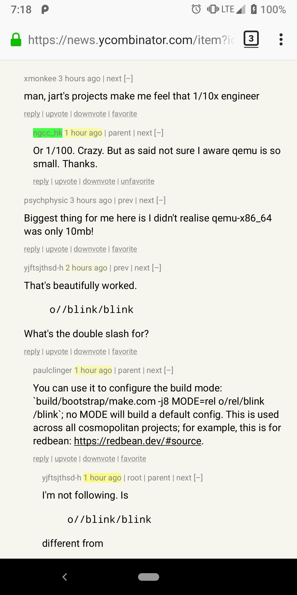

Basic tuning of the HN interface:

- Relocates the upvote/downvote links.
- Highlights recent comments.
- Highlights favorite users.

Installation:

- Use the `.xpi` file matching your browser:
  - [chrome.xpi](chrome-1668917197.xpi)
  - [firefox.xpi](firefox-1668917197.xpi)
- Build your own `.xpi` with `xpi-build.sh`.

I haven't been able to outsmart Firefox Android Nightly: it hates extensions with passion and won't let you install one no matter what.

